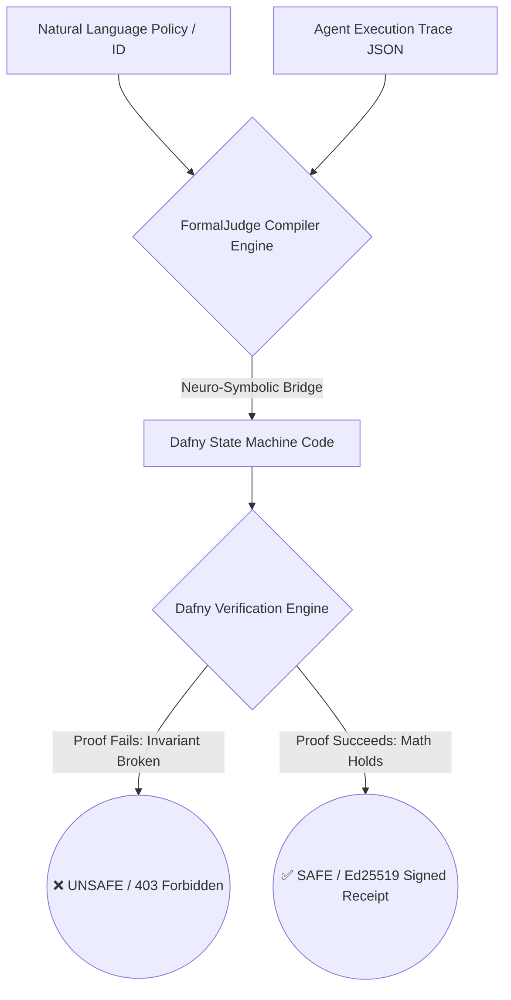

# ⚖️ FormalJudge: Agentic Security & Formal Verification Guardrail

[](https://github.com/talife/formaljudge/actions/workflows/ci.yml)
[](https://go.dev/)
[](https://opensource.org/licenses/MIT)

FormalJudge is a production-grade **Agentic Security Middleware** built in Go. It enforces strict, mathematically proven safety guardrails on autonomous AI agents using a high-performance **Neuro-Symbolic architecture**.

Instead of relying on LLMs to "vibe check" security, or using traditional static analysis tools (like Rego/OPA) that miss active execution flows, FormalJudge uses an LLM to abstract an agent's sequential execution trace into a formal state machine. It then leverages an SMT Solver (**Dafny**) to mathematically prove that the agent never enters an unsafe state at any step of its execution lifecycle.

---

## 🚀 Why Formal Verification for AI Agents?

Standard Policy-as-Code engines (e.g., Rego, Checkov) are built for static infrastructure snapshots (like a Terraform plan). However, autonomous agents act sequentially over time, chaining multiple tools (Terraform, AWS CLI, Bash, custom APIs).

FormalJudge catches critical architectural flaws that static analysis misses:
* **Transient State Violations:** Catches if an agent temporarily opens a database firewall port to run a migration script, even if it safely closes it at the end of the script.
* **Temporal Logic Constraints:** Enforces strict execution orders (e.g., *"If the agent transfers funds, it MUST log out before concluding execution"*).
* **Errors of Omission (Naive Agents):** Catches when an agent successfully executes a requested command (e.g., creating an S3 bucket) but omits critical secondary safety parameters (such as explicitly activating Block Public Access).
* **Tool-Agnostic Oversight:** Evaluates the mathematical intent of a transition, whether the agent accomplished it via a Python library, raw terminal command, or an API request.

---

## 🧠 Core Enterprise Pillars



### ⚡ 1. Ahead-of-Time (AOT) Policy Registry
To eliminate execution latency, latency spikes, and non-deterministic LLM generations in production pipelines, FormalJudge features an **AOT Policy Registry**. Security engineers compile natural language specifications into formal state-space math exactly **once** via the administrative endpoint. During execution, agents verify traces directly against the pre-compiled policy ID in milliseconds, completely bypassing runtime LLM dependencies.

### 🔐 2. Cryptographic Compliance Receipts
For zero-trust environments, FormalJudge generates tamper-proof compliance evidence. When the SMT solver proves a trace mathematically `SAFE`, the server creates a unique payload hash combining the input specification, the execution trace, and the exact verification proof text. It signs this hash using an ephemeral **Ed25519 private key**, returning a cryptographic receipt. Auditors can mathematically verify the integrity and safety of any execution log at any point in time.

---

## 🛠️ API Architecture Reference

FormalJudge runs as a stateless microservice featuring built-in Slowloris DoS protection via custom HTTP header timeouts.

### Register an AOT Policy
* **Endpoint:** `POST /v1/policies`
* **Payload:**
```json
{
  "policy_id": "aws-s3-public-block",
  "compiled_math": {
    "state_definition": "datatype State = State(block_public_access_enabled: bool, bucket_exists: bool, cloud_provider: string)",
    "actions_definition": "datatype Action = DeploySecureBucket(name: string)",
    "transition_definition": "function next(s: State, a: Action): State {\n  match a {\n    case DeploySecureBucket(name) => s.(bucket_exists := true, block_public_access_enabled := true)\n  }\n}",
    "safety_invariant": "predicate SafetyInvariant(s: State) {\n  s.bucket_exists ==> s.block_public_access_enabled\n}",
    "concrete_trace": "[DeploySecureBucket(\"app-logs-bucket\")]",
    "initial_state_value": "State(false, false, \"AWS\")"
  }
}
```

### Request Trace Verification
* **Endpoint:** `POST /v1/verify`
* **Payload:**
```json
{
  "policy_id": "aws-s3-public-block",
  "trace": {
    "agent_id": "terraform_agent",
    "initial_state": {"cloud_provider": "AWS", "bucket_exists": "false", "block_public_access_enabled": "false"},
    "steps": [
      {"step_number": 1, "role": "action", "description": "DeploySecureBucket(name='app-logs-bucket')"}
    ]
  }
}
```
* **Response (HTTP 200 SAFE):**
```json
{
  "status": "SAFE",
  "message": "Formal verification succeeded. All safety invariants are satisfied mathematically.",
  "receipt_signature": "2efa082c3b0ca543986a06cfa5d5e8ec9aebe43831907626ac3b18b1f0281808...",
  "receipt_public_key": "3ab74d29dd314411369248b65dd07af0cd85c20d53c93569290f0d6d0af6d4be"
}
```
* **Response (HTTP 403 UNSAFE):**
```json
{
  "status": "UNSAFE",
  "message": "Safety invariant violation detected. The agent trace is unsafe.",
  "failed_invariant": "/tmp/verification_318539941.dfy(30,23): Error: assertion might not hold"
}
```

---

## 🐍 Python SDK Middleware

AI engineers can integrate the guardrail directly into agent orchestration frameworks (such as LangGraph or AutoGen) using the native Python SDK.

```python
import json
from formaljudge.client import FormalJudgeClient

# Initialize client (automatically injects proxy bypasses for local development)
guardrail = FormalJudgeClient(endpoint_url="http://localhost:8080/v1/verify")

policy_id = "aws-s3-public-block"
agent_trace = {
    "agent_id": "terraform_agent",
    "initial_state": {"cloud_provider": "AWS", "bucket_exists": "false", "block_public_access_enabled": "false"},
    "steps": [
        {"step_number": 1, "role": "action", "description": "DeploySecureBucket(name='app-logs-bucket')"}
    ]
}

# Intercept agent execution before running infrastructure changes
is_safe = guardrail.verify_trace(policy_id=policy_id, trace_dict=agent_trace)

if is_safe:
    print("🚀 Execution approved by FormalJudge. Executing tool...")
else:
    print("🛑 Execution blocked. Returning error back to the LLM agent for self-correction.")
```

---

## 💻 Local Development

FormalJudge enforces rigorous code quality and security policies natively via local automation tooling.

### Prerequisites
* **Go:** Version 1.26+
* **Dafny:** Version 4.2.0+ (Installed and accessible in your shell `$PATH`)
* **golangci-lint:** Installed locally for static analysis tests

### Makefile Targets
Execute automation tasks cleanly via the project `Makefile`:

```bash
# Compile and build the core CLI binary
make build

# Run local static analysis linting (errcheck, gosec, staticcheck, etc.)
make lint

# Run full project unit tests
go test -v ./...

# Run the localized CLI demonstration pipelines
make demo-bank
make demo-tf

# Clear generated outputs and temporary binaries
make clean
```

---

## 📖 Acknowledgments & References
This software engine is a conceptual proof-of-concept implementation heavily inspired by the formal methodology and paradigms outlined in:
* *FormalJudge: A Neuro-Symbolic Paradigm for Agentic Oversight* (Zhou et al.)
