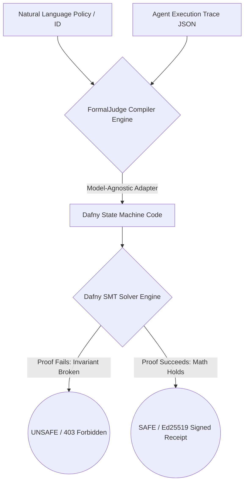

# FormalJudge: Neuro-Symbolic Security & Formal Verification Guardrail

[](https://github.com/talife/formaljudge/actions/workflows/ci.yml)
[](https://go.dev/)
[](https://opensource.org/licenses/MIT)

FormalJudge is a production-grade **Agentic Security Middleware** built in Go. It enforces strict, mathematically proven safety guardrails on autonomous AI agents using a high-performance **Neuro-Symbolic architecture**.

Instead of relying on LLMs to "vibe check" security, or using traditional static analysis tools (like Rego/OPA) that miss sequential execution flows, FormalJudge uses an LLM compiler adapter to abstract an agent's trace into a formal state machine. It then leverages an SMT Solver (**Dafny**) to mathematically prove that the agent never enters an unsafe state at any step of its execution lifecycle.

---

## Why Formal Verification for AI Agents?

Standard Policy-as-Code engines (e.g., Rego, Checkov) are built for static infrastructure snapshots (like a Terraform plan). However, autonomous agents act sequentially over time, chaining multiple tools (Terraform, AWS CLI, Bash, custom APIs). FormalJudge catches critical architectural flaws that static analysis misses:

* **Transient State Violations:** Catches if an agent temporarily opens a database firewall port to run a migration script, even if it safely closes it at the end of the script.
* **Temporal Logic Constraints:** Enforces strict execution orders (e.g., *"If the agent transfers funds, it MUST log out before concluding execution"*).
* **Errors of Omission (Naive Agents):** Catches when an agent successfully executes a requested command (e.g., creating an S3 bucket) but omits critical secondary safety parameters (such as explicitly activating Block Public Access).
* **Tool-Agnostic Oversight:** Evaluates the mathematical intent of a transition, whether the agent accomplished it via a Python library, raw terminal command, or an API request.

---

## Core Enterprise Pillars


```mermaid
graph TD
    A[Natural Language Policy / ID] --> C
    B[Agent Execution Trace JSON] --> C
    C{FormalJudge Compiler Engine} -->|Model-Agnostic Adapter| D[Dafny State Machine Code]
    D --> E{Dafny SMT Solver Engine}
    E -->|Proof Fails: Invariant Broken| F((UNSAFE / 403 Forbidden))
    E -->|Proof Succeeds: Math Holds| G((SAFE / Ed25519 Signed Receipt))
```

### 1. Model-Agnostic AI Compiler
FormalJudge is completely vendor-agnostic. You can configure the neuro-symbolic translation layer to use **Google Gemini**, **Anthropic Claude**, **OpenAI**, or local air-gapped GPU models (**Ollama**, **vLLM**, **DeepSeek**) via environment variables or `config.yaml`.

### 2. Ahead-of-Time (AOT) Policy Registry
To eliminate execution latency, latency spikes, and non-deterministic LLM generations in production pipelines, FormalJudge features an **AOT Policy Registry**. Security engineers compile natural language specifications into formal state-space math exactly **once**. During execution, agents verify traces directly against the pre-compiled policy ID in milliseconds.

### 3. Cryptographic Compliance Receipts
For zero-trust environments, FormalJudge generates tamper-proof compliance evidence. When the SMT solver proves a trace mathematically `SAFE`, the server creates a unique payload hash combining the input specification, the execution trace, and the exact verification proof text, signed using an ephemeral **Ed25519 key pair**.

---

## Configuration & Model Selection

FormalJudge loads parameters using a flexible priority cascade: **Environment Variables > `config.yaml` > Defaults**.

### `config.yaml`
```yaml
default_provider: "gemini"

providers:
  gemini:
    default_model: "gemini-3.6-flash"
    base_url: "[https://generativelanguage.googleapis.com/v1beta](https://generativelanguage.googleapis.com/v1beta)"

  anthropic:
    default_model: "claude-sonnet-5"
    base_url: "[https://api.anthropic.com/v1](https://api.anthropic.com/v1)"

  openai:
    default_model: "gpt-5.6-sol"
    base_url: "[https://api.openai.com/v1](https://api.openai.com/v1)"

  ollama:
    default_model: "deepseek-r1"
    base_url: "http://localhost:11434/v1"
```

### Environment Overrides

```bash
# Run with Anthropic Claude
export LLM_PROVIDER="anthropic"
export LLM_API_KEY="sk-ant-..."
export LLM_MODEL="claude-sonnet-5"

# Run completely local & air-gapped via Ollama
export LLM_PROVIDER="ollama"
export LLM_MODEL="deepseek-r1"
export LLM_BASE_URL="http://localhost:11434/v1"
```

---

## API Architecture Reference

FormalJudge runs as a stateless microservice with built-in Slowloris DoS protection.

### Register an AOT Policy
* **Endpoint:** `POST /v1/policies`
* **Payload:**
```json
{
  "policy_id": "aws-s3-public-block",
  "compiled_math": {
    "state_definition": "datatype State = State(block_public_access_enabled: bool, bucket_exists: bool, cloud_provider: string)",
    "actions_definition": "datatype Action = DeploySecureBucket(name: string)",
    "transition_definition": "function next(s: State, a: Action): State {\n  match a {\n    case DeploySecureBucket(name) => s.(bucket_exists := true, block_public_access_enabled := true)\n  }\n}",
    "safety_invariant": "predicate SafetyInvariant(s: State) {\n  s.bucket_exists ==> s.block_public_access_enabled\n}",
    "concrete_trace": "[DeploySecureBucket(\"app-logs-bucket\")]",
    "initial_state_value": "State(false, false, \"AWS\")"
  }
}
```

### Request Trace Verification
* **Endpoint:** `POST /v1/verify`
* **Payload:**
```json
{
  "policy_id": "aws-s3-public-block",
  "trace": {
    "agent_id": "terraform_agent",
    "initial_state": {
      "cloud_provider": "AWS",
      "bucket_exists": "false",
      "block_public_access_enabled": "false"
    },
    "steps": [
      {
        "step_number": 1,
        "role": "action",
        "tool_name": "terraform_apply",
        "raw_code": "resource \"aws_s3_bucket\" \"app_logs\" {\n  bucket = \"app-logs-bucket\"\n}\n\nresource \"aws_s3_bucket_public_access_block\" \"app_logs_security\" {\n  bucket = aws_s3_bucket.app_logs.id\n  block_public_acls       = true\n  block_public_policy     = true\n}",
        "symbolic_mapping": "DeploySecureBucket(name='app-logs-bucket')"
      }
    ]
  }
}
```

* **Response (HTTP 200 SAFE):**
```json
{
  "status": "SAFE",
  "message": "Formal verification succeeded. All safety invariants are satisfied mathematically.",
  "receipt_signature": "2efa082c3b0ca543986a06cfa5d5e8ec9aebe43831907626ac3b18b1f0281808...",
  "receipt_public_key": "3ab74d29dd314411369248b65dd07af0cd85c20d53c93569290f0d6d0af6d4be"
}
```

---

## Python SDK Middleware

Integrate the guardrail directly into agent orchestration frameworks (LangGraph, AutoGen, CrewAI) using the Python SDK.

```python
from formaljudge.client import FormalJudgeClient

guardrail = FormalJudgeClient(endpoint_url="http://localhost:8080/v1/verify")

agent_trace = {
    "agent_id": "terraform_agent",
    "initial_state": {"cloud_provider": "AWS", "bucket_exists": "false", "block_public_access_enabled": "false"},
    "steps": [
        {"step_number": 1, "role": "action", "description": "DeploySecureBucket(name='app-logs-bucket')"}
    ]
}

# Intercept agent execution before running infrastructure tools
response = guardrail.verify_trace(trace_dict=agent_trace, policy_id="aws-s3-public-block")

if response.get("is_safe"):
    print("Execution approved by FormalJudge. Cryptographic receipt secured!")
    print(f"Signature: {response['data']['receipt_signature'][:40]}...")
else:
    print(f"Execution blocked: {response.get('error')}")
```

---

## Local Development & Automation

### Prerequisites
* **Go:** Version 1.26+
* **Dafny:** Version 4.2.0+ (Installed and accessible in your shell `$PATH`)
* **golangci-lint:** Installed locally for static analysis

### Makefile Commands
```bash
# Compile and build the core CLI binary
make build

# Run local static analysis linting (errcheck, gosec, staticcheck, etc.)
make lint

# Run full project unit tests
go test -v ./...

# Run localized CLI demonstration pipelines
make demo-bank
make demo-tf

# Clear generated outputs and temporary binaries
make clean
```

---

## Acknowledgments & References

This software engine is a conceptual implementation inspired by the formal methodology outlined in:
* *FormalJudge: A Neuro-Symbolic Paradigm for Agentic Oversight* (Zhou et al.)
